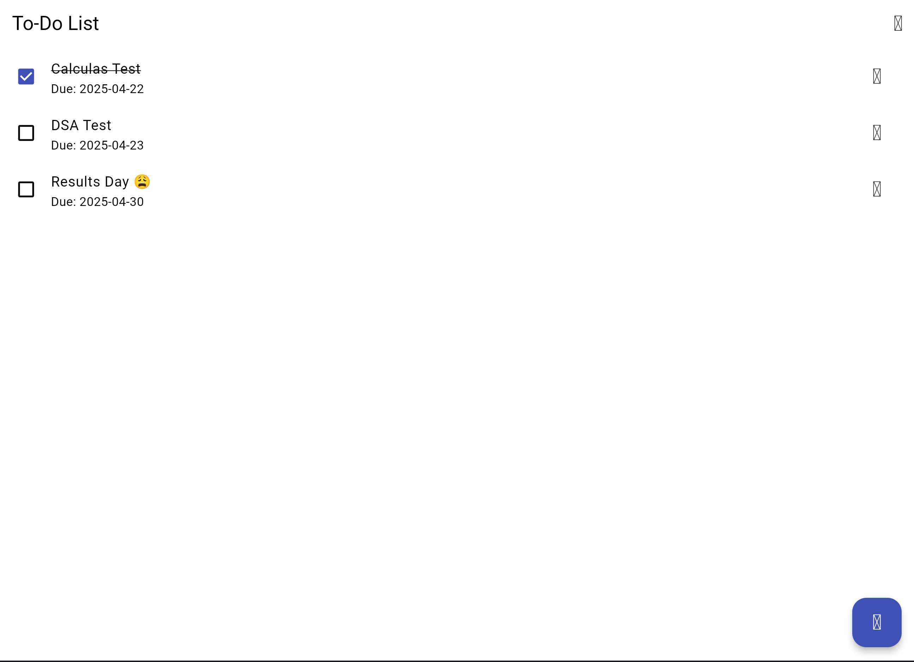
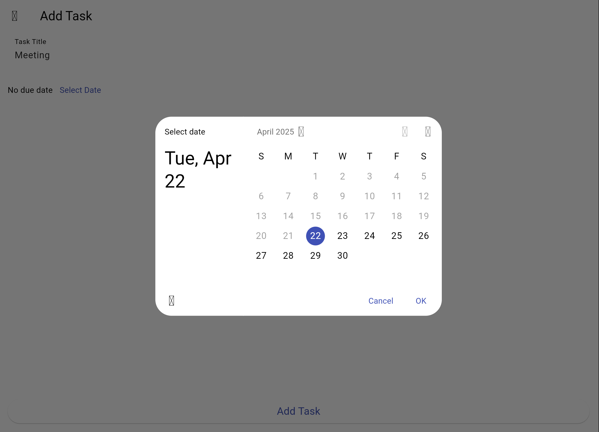

# ✅ To-Do List App (Flutter)

A simple and effective **To-Do List app** built using **Flutter**. This app helps users manage their daily tasks with the ability to **add, update, modify deadlines**, and **bookmark completed tasks**. It's designed with clean UI and responsive layout to work smoothly on all devices.

---

**@uthor: Muhammad Abu-BAkr**

---

## 📱 App Features

- ➕ Add new tasks with a title and due date
- ✏️ Modify or update existing tasks (e.g., change due date)
- 🔖 Bookmark tasks once completed
- 🗂️ View active vs. completed tasks
- 📆 Display task dates clearly for better planning
- 📱 Responsive UI that works across Android and iOS
- 🚫 Slide to delete an existing task
  
---

## 🧠 Skills Demonstrated

- Flutter widget composition
- State management using `setState`
- Working with `ListView`, `TextField`, `DatePicker`, and `Checkbox`
- UI logic for marking tasks complete/bookmarked
- Responsive and scrollable layouts
- Data modeling with Dart classes

---

## 📘 What I Learned
- Building a dynamic UI using ListView.
- builderHandling user input with TextEditingController
- Managing app state and user interactions
- Working with date selection and formatting in Flutter
- Creating modular code with custom widgets

---

## 🔮 Future Improvements
- 🛎️ Add notifications/reminders for upcoming tasks
- 🌓 Implement dark mode toggle
- 🔍 Add filtering by date, priority, or completion

---

### 📸 Screenshots




---

## 🚀 Getting Started

### Prerequisites

- Flutter SDK
- Android Studio or VS Code
- Dart plugin installed

### Run the App

```bash
git clone https://github.com/MuhammadAbu-Bakr/to_do_list_app
cd to_do_list_app
flutter pub get
flutter run

